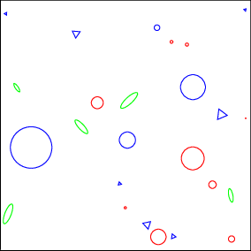
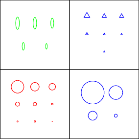

# `cosmic_dustbox`
A package that aims at bringing models of cosmic dust to Python to make working
with them easier.

*Note:* very early development at the moment so it does not yet do too many
useful things and the API _will_ change.

## Installation
- Clone the repo: `git clone
  git@gitlab.mpcdf.mpg.de:mglatzle/cosmic_dustbox.git`
- `cd cosmic_dustbox`
- `python setup.py install`

## Examples
Note: `cosmic_dustbox` uses `astropy.units` throughout.

Evaluating the Weingartner & Draine 2001 size distributions for carbonaceous
and silicate grains for R\_V=3.1 and b\_C=6.0e-5 in case 'A' at a range of
grain sizes between 1 nm and 1 micron:

```
>>> import astropy.units as u
>>> import cosmic_dustbox as cb
>>> import numpy as np
>>> sd_car, sd_sil = cb.sdist.WD01(3.1, 6.0, 'A')
>>> sizes = np.logspace(-9, -6, num=10)*u.m
>>> sd_car(sizes)
<Quantity [7.39939133e+00, 9.02469859e-02, 1.94996300e-02, 1.07158763e-03,
           1.18483502e-04, 1.30850238e-05, 1.24648409e-06, 9.43835731e-08,
           2.41782877e-09, 2.43258206e-15] 1 / m>
>>> sd_sil(sizes)
<Quantity [7.86318728e+000, 6.70676535e-001, 5.73425242e-002,
           4.92807748e-003, 4.28146066e-004, 3.80362296e-005,
           3.52990312e-006, 3.09011411e-007, 7.19725776e-020,
           9.29346597e-263] 1 / m>
```

## Philosophy
In 1930, after confirming that distant stars in the Milky Way are dimmed more
strongly than one would expect from geometry, Trumpler conjectured the
existence of "dust particles of various sizes" in the interstellar space of our
Galaxy. Countless observations have since then confirmed this and the
"interstellar extinction" remains one of the observational pillars of the study
of cosmic dust. It was later discovered that there is dust also in
interplanetary space and that it is important for planet formation, there is
dust in other galaxies, even far away galaxies, and maybe there also is dust in
intergalactic space. It was confirmed that dust grains do indeed come in
different sizes and, moreover, in different shapes and different chemical
compositions. In short, while many things have been understood, it also became
apparent that cosmic dust is very complicated. The goal of this software
package is to make work with models of cosmic dust on the computer easier while
still providing control over all the involved intricacies. An ambitious goal
for sure, but we'll try our best.

To introduce the objects central to how we describe cosmic dust, assume we are
interested in the dust in a certain environment. Assume then that we cut some
volume out of said environment. The volume should, of course, be representative
of the environment. So if we are interested in the dust in the Solar System as
a whole, a cubic meter of space somewhere between Earth and Mars will be too
small and a box the size of the Milky Way will be too large. Suppose we
collected all of the dust grains contained in this volume. We would like to be
able to describe this collection with a reasonable degree of accuracy without
having to store information on every single grain. If we investigated the
properties of single grains, at first the diversity would probably be
overwhelming since hardly any two grains would be exactly alike. But after
looking at enough grains, we would start discovering similarities. Grains that
have similar structure, grains that look like larger or smaller versions of
other grains, grains that have similar chemical composition and so on. So if we
are fine with some level of abstraction and generalization, our grain
collection could be represented like this:



with color-coded chemical composition. How do we go about categorizing these
grains so that we can think in these categories without worrying about
individual grains? Two obvious properties to group by are the chemical
composition and the shape:



The "blueprint grain", which we can rescale to obtain any of the grains in one
of the groups, is referred to as a grain species. So one of our groups is
simply a grain species combined with a size distribution and we call it a grain
population. If we think back to the abstract representation of our collection
of grains, it is not very different from one of the groups. It simply has more
than one grain species, each with its associated size distribution. So to keep
it simple, we will also call this a grain population.

So, to recap, what we need to describe a collection of grains are:

- grain species
- size distributions
- grain populations

This approach can be refined as needed by simply splitting grain species. In
the extreme, we would have one species per grain and each species would have a
delta-peak size distribution and we would be back to the overwhelming diversity
we started out from. With this package, we aim to translate the approach to
software. The size distribution class in `sdist.py` is already in a somewhat
advanced state so feel free to check it out.

## Literature
"Physics of the Interstellar and Intergalactic Medium" by B. Draine provides a
good introduction (and much more than that) to cosmic dust.
